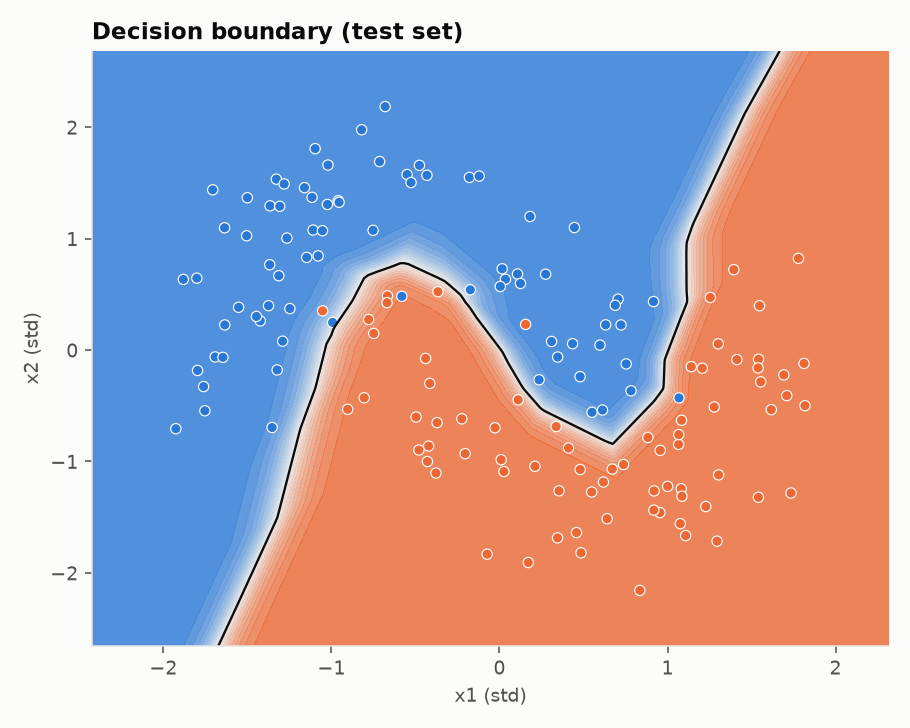

# 00. Foundations

A neural network built from scratch in NumPy, one concept per module, with the math explained from
first principles. No PyTorch, no autograd: every forward pass, every gradient, every parameter update
is written out so you can read it.

The network learns to separate two interleaved half moons. It reaches about 97% test accuracy with
337 parameters. Getting there covers the ideas you need before touching a real framework: data
splits and leakage, weight initialization, activations, cross-entropy, backpropagation, mini-batch
SGD, overfitting, gradient checking, model persistence and serving.



## Quick start

Requires [uv](https://docs.astral.sh/uv/). Python 3.13 is installed automatically.

```bash
uv sync            # install everything
make run           # train, print metrics, write plots and the model to outputs/
make serve         # serve the trained model at http://127.0.0.1:8000/docs
make notebooks     # open the interactive notebooks
make check         # lint, type-check, test
```

`make run` prints something like:

```
network (2, 16, 16, 1) | 337 parameters
gradient check | relative error 5.30e-11 (OK)

epoch   20 | train loss 0.2706 acc 0.883 | val loss 0.2463 acc 0.873
epoch  100 | train loss 0.0809 acc 0.979 | val loss 0.0848 acc 0.973
epoch  200 | train loss 0.0512 acc 0.986 | val loss 0.0626 acc 0.987

test loss 0.0981 | test accuracy 0.973
confusion | TP=72 TN=74 FP=2 FN=2
precision 0.973 | recall 0.973
```

Hyperparameters can be overridden from the command line:

```bash
uv run foundations --lr 0.5 --epochs 50 --batch-size 8 --seed 7
```

## The guides

Start with the concept map and read in order. Each guide explains one idea, points at the module that
implements it, and ends with experiments to run.

| # | Guide | Module |
|---|-------|--------|
| 00 | [Concept map](docs/00-concept-map.md) | - |
| 01 | [Data](docs/01-data.md) | `data/` |
| 02 | [Neurons and layers](docs/02-neurons-and-layers.md) | `nn/layers.py` |
| 03 | [Activations](docs/03-activations.md) | `nn/activations.py` |
| 04 | [Loss function](docs/04-loss-function.md) | `nn/losses.py` |
| 05 | [Backpropagation](docs/05-backpropagation.md) | `nn/network.py` |
| 06 | [Gradient descent](docs/06-gradient-descent.md) | `nn/optimizers.py` |
| 07 | [Training and evaluation](docs/07-training-and-evaluation.md) | `training/` |
| 08 | [Gradient check](docs/08-gradient-check.md) | `diagnostics/` |
| 09 | [Persistence and serving](docs/09-persistence-and-serving.md) | `persistence.py`, `api/` |
| 10 | [Next steps](docs/10-next-steps.md) | - |

## Notebooks

`notebooks/` has one [marimo](https://marimo.io) notebook per guide, 01 through 08. Each one imports the
package and turns the guide's experiments into sliders: change the noise and watch the dataset move,
change the learning rate and watch the loss curve, flip a switch that breaks the backward pass and
watch the gradient check catch it.

```bash
make notebooks                              # opens the whole folder
uv run marimo edit notebooks/06_gradient_descent.py
```

marimo notebooks are plain Python files, so they diff cleanly in git and run headless
(`tests/test_notebooks.py` executes every one of them in CI). Cells re-run automatically when
something they depend on changes, so there is no stale state to reason about.

## Project layout

```
00. foundations/
├── src/foundations/
│   ├── data/            dataset generation, splitting, standardization
│   ├── nn/              activations, dense layer, network, loss, optimizer
│   ├── training/        training loop, metrics, history
│   ├── diagnostics/     numerical gradient check
│   ├── visualization/   plot style and figures
│   ├── api/             FastAPI app, request schemas, model service
│   ├── config.py        every hyperparameter, as frozen dataclasses
│   ├── experiment.py    wires data + network + training into one run
│   ├── persistence.py   save and load a trained model (.npz)
│   └── cli.py           `foundations` command
├── notebooks/           one marimo notebook per guide, interactive versions of the experiments
├── tests/               mirrors src/, plus a headless run of every notebook
├── docs/                the guides and their figures
├── scripts/             make_figures.py regenerates every figure in docs/
├── outputs/             plots and model.npz written by `make run` (gitignored)
├── Makefile             run, serve, test, lint, typecheck, figures, docker
├── Dockerfile           containerized API
└── .github/workflows    CI: ruff, ty, pytest
```

The dependency direction is strictly downward: `nn/` knows nothing about `training/`, and
`training/` knows nothing about the API. Each layer can be read on its own.

## Design choices

**Functional and immutable.** Layers are frozen dataclasses. `forward` returns a new output and a
cache; `sgd_step` returns a new network. Nothing is mutated in place. This is how JAX works and it
makes the data flow visible, which is the point of a learning project.

**One random generator.** Every source of randomness (data, shuffling, initialization, batch order)
draws from a single seeded `np.random.Generator`. Runs are reproducible bit for bit.

**Validation at the boundary.** The API validates every request with pydantic and rejects malformed
input with 422. Inside the boundary, functions trust their inputs and do not re-check shapes.

**Preprocessing travels with the model.** The saved artifact contains the network, the standardizer
fitted on training data, and metadata about how it was trained. A model without its preprocessing is
not a model.

## Serving

```bash
make serve
curl -X POST localhost:8000/predict \
  -H 'content-type: application/json' \
  -d '{"points": [{"x1": 0, "x2": 1}, {"x1": 1, "x2": -0.5}]}'
```

| Endpoint | Purpose |
|----------|---------|
| `GET /health` | Liveness and whether a model is loaded |
| `GET /model` | Architecture, parameter count, training config, test metrics |
| `POST /predict` | Raw coordinates in, probabilities and labels out |
| `POST /train` | Retrain with new hyperparameters and hot-swap the served model |

Set `FOUNDATIONS_MODEL_PATH` to serve a model from a different location. `make docker` builds and runs
the same API in a container.

## Tooling

| Tool | Role |
|------|------|
| [uv](https://docs.astral.sh/uv/) | Environment, dependencies, lockfile, Python version |
| [ruff](https://docs.astral.sh/ruff/) | Linting and formatting |
| [ty](https://docs.astral.sh/ty/) | Type checking |
| [pytest](https://docs.pytest.org/) | Tests |
| [FastAPI](https://fastapi.tiangolo.com/) | Serving |
| [marimo](https://marimo.io) | Reactive notebooks stored as plain Python |
| pre-commit | Runs ruff and keeps `uv.lock` in sync on every commit |

## What comes next

This is project 00 of a series.

| # | Project | What it is |
|---|---------|------------|
| 00 | dl-foundations (this repo) | The full network as a package, one concept per module |
| 01 | [dl-notebooks](https://github.com/brian-rey-development/dl-notebooks) | Jupyter notebooks that start earlier and go slower: the 1943 neuron, the perceptron, gradient descent, one idea at a time |
| 02 | PyTorch rebuild (planned) | The same network in PyTorch, so every line of framework code maps to something written by hand here |

See [Next steps](docs/10-next-steps.md) for what is missing between this and a real framework.
