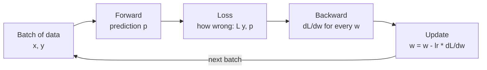
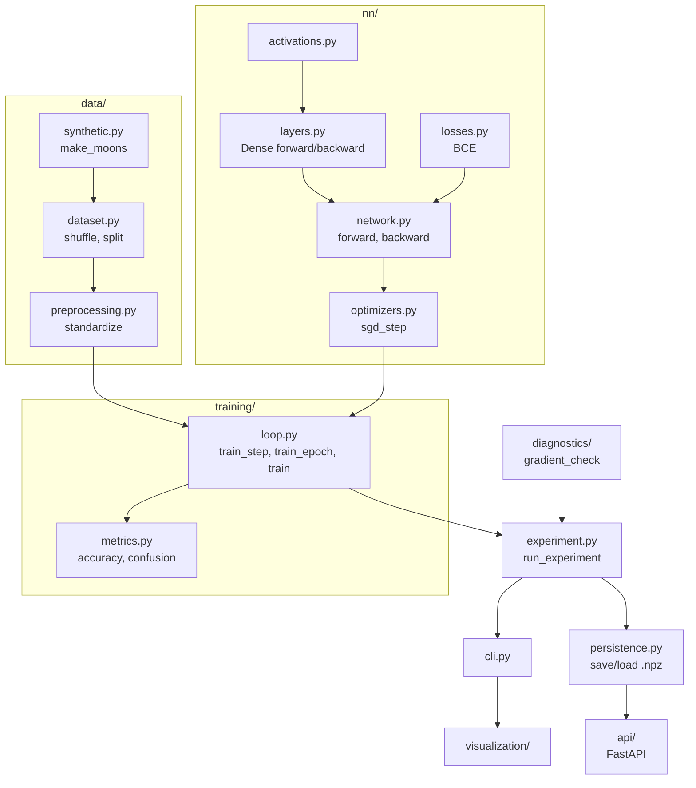

# 00. Concept map

This is the index. Every concept lives in one module of the package and has its own guide. Read
them in order: each guide assumes the previous one.

## What "learning" means for a neural network

A neural network is a function with knobs (parameters). Learning is turning the knobs until the
function produces outputs close to the ones we want. Everything else is detail about how to turn
the knobs efficiently.

The cycle, repeated thousands of times:

In code, that cycle is `train_step` in `training/loop.py`. Four lines.

## The concepts and where they live

| # | Guide | Question it answers | Module |
|---|-------|---------------------|--------|
| 01 | [Data](01-data.md) | What the network learns from, and how we avoid fooling ourselves | `data/` |
| 02 | [Neurons and layers](02-neurons-and-layers.md) | What the "function with knobs" is | `nn/layers.py` |
| 03 | [Activations](03-activations.md) | Why the network can learn curves instead of only lines | `nn/activations.py` |
| 04 | [Loss function](04-loss-function.md) | How we measure "how wrong" with a single number | `nn/losses.py` |
| 05 | [Backpropagation](05-backpropagation.md) | How we know how much each knob is to blame | `nn/network.py`, `nn/layers.py` |
| 06 | [Gradient descent](06-gradient-descent.md) | How we use the blame to adjust | `nn/optimizers.py` |
| 07 | [Training and evaluation](07-training-and-evaluation.md) | How everything is orchestrated, and how we know it worked | `training/` |
| 08 | [Gradient check](08-gradient-check.md) | How we verify the math is right | `diagnostics/` |
| 09 | [Persistence and serving](09-persistence-and-serving.md) | How we save the model and use it from outside | `persistence.py`, `api/` |
| 10 | [Next steps](10-next-steps.md) | What is missing between this and PyTorch | - |

## How the code flows

Dependencies only point downward: `nn/` does not know `training/` exists, and `training/` does not
know the API exists. You can read each layer without understanding the one above it.

## Minimum vocabulary

- **Parameter**: a number the network adjusts (weights and biases). The default network has 337.
- **Hyperparameter**: a number you choose before training (learning rate, epochs, layer sizes). They live in `config.py`.
- **Forward pass**: computing the prediction from the input.
- **Backward pass**: computing the gradient of the loss with respect to every parameter.
- **Epoch**: one full pass over the training data.
- **Batch**: the subset of data processed in one step.
- **Gradient**: the vector of partial derivatives. It points where the loss grows fastest.

## One mental model for the whole project

A blindfolded hiker on a mountain wants to reach the valley. Altitude is the loss. The hiker can only
feel the slope under their feet: that is the gradient. They step downhill by a fixed amount: the
learning rate. Repeat. The gradient check is confirming their sense of slope works before they start walking.

The metaphor breaks in one place worth knowing about: the mountain has 337 dimensions, not 2. The
geometric intuition of valleys and peaks still helps, but in that many dimensions local minima are rare
and saddle points (downhill one way, uphill another) are the norm.
