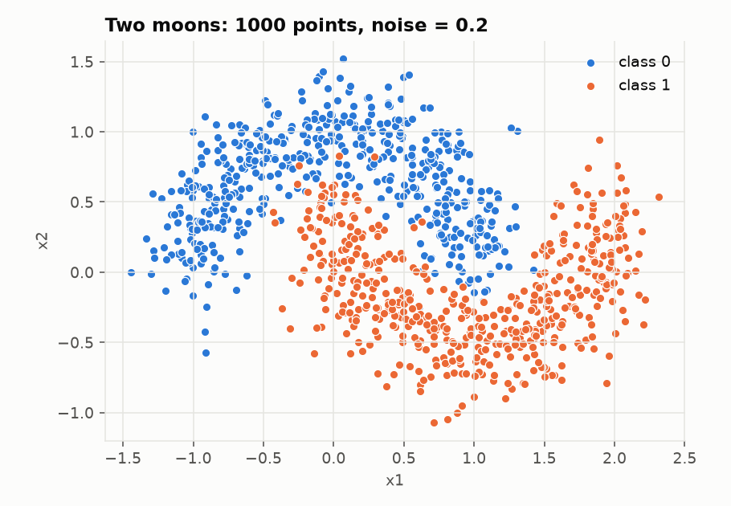
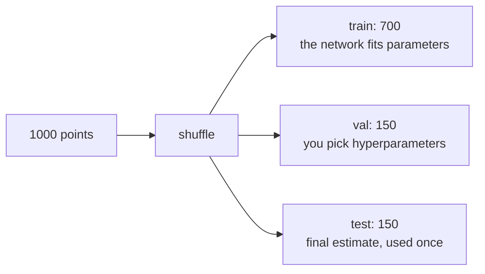

# 01. Data

Modules: `data/synthetic.py`, `data/dataset.py`, `data/preprocessing.py`

## Features and labels

Each example has an input `x` (features) and a desired output `y` (label). Here:

- `x`: two numbers, the coordinates of a point in the plane. Shape `(n, 2)`.
- `y`: 0 or 1, which moon the point belongs to. Shape `(n, 1)`.

Shapes matter more than they look. Most deep learning bugs are incompatible shapes. Get in the habit
of asking "what shape is this" on every line.

## The dataset

`make_moons` generates two interleaved half moons. It was chosen for three reasons:

1. It is 2D, so you can draw the decision boundary and see what the network learned.
2. No straight line separates the two classes well. This forces the network to use hidden layers and
   non-linear activations. With linearly separable data you would learn nothing about why neural
   networks exist.
3. You control the noise. `noise=0` is trivial, `noise=0.5` is impossible. The interesting part is in between.

## Train, validation and test

| Split | Who uses it | When |
|-------|-------------|------|
| train | The network, through gradients | Every step |
| val | You, looking at curves | Between experiments |
| test | Nobody | At the very end, once |

Why three and not two: if you pick hyperparameters by looking at the test set, the test set stops
being an honest estimate. Information leaks from the test set into your decisions. This is called
**data leakage** and it is the most common way to fool yourself in machine learning. A model that
scores 99% on test after being picked from 50 configurations by looking at that same test set does
not have 99%.

The `shuffle` before splitting matters: `make_moons` generates all class 0 points first, then all
class 1. Without shuffling, train would contain only class 0 and test only class 1.

## Standardization

`standardize` transforms each feature to mean 0 and standard deviation 1:

$$x' = \frac{x - \mu}{\sigma}$$

Gradient descent works worse when features have different scales (one in meters, one in millimeters).
The loss surface becomes a long narrow valley and the steps zigzag from wall to wall. With
standardized features the valley is rounder and you go straight down.

The critical detail in `standardize_split`: the mean and standard deviation are computed **on train
only** and then applied to val and test. If you computed them on the whole dataset, you would be
using test information to transform the training data. Another form of leakage, subtler than the first.

`standardize_split` returns the fitted `Standardizer` along with the data. Guide 09 explains why:
when the model is served, every new point must go through exactly the same transformation, with the
training mean and standard deviation.

## Reproducibility

Everything random (generating data, shuffling, initializing weights, ordering batches) goes through a
single `np.random.Generator` created from a fixed seed. Same seed, same results, bit for bit. Without
this you cannot tell "my change improved the model" from "I got lucky with the randomness".

## Experiments

- Change `noise` in `config.py` to 0.05 and to 0.4. Watch the test accuracy move.
- Change `seed`. Accuracy shifts a little. That shift is noise, not signal. When you compare two
  models, the difference has to be bigger than that shift to mean anything.
- Multiply the first column of `x` by 100 in `make_moons` and train with and without standardization.
