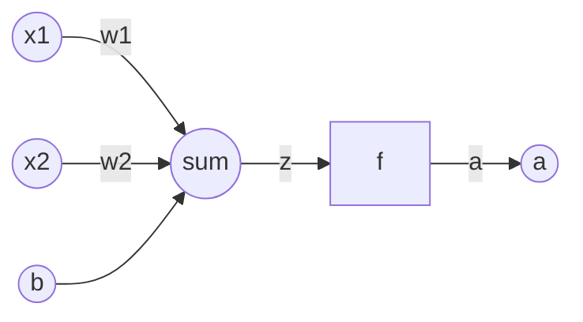
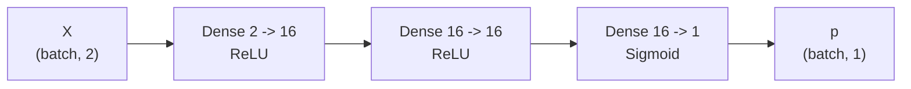
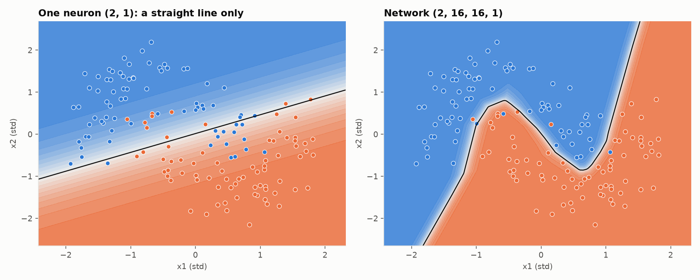

# 02. Neurons and layers

Module: `nn/layers.py`

## One neuron

$$z = w_1 x_1 + w_2 x_2 + b \qquad a = f(z)$$

- $w_i$ are the **weights**: how much each input matters.
- $b$ is the **bias**: it shifts the result. Without it, when every input is 0 the output is always
  $f(0)$, and the neuron cannot represent something as simple as "always 1".
- $z$ is the **pre-activation**. It is stored in the cache because the backward pass needs it.
- $f$ is the activation (guide 03).

A single neuron is logistic regression. It can only draw a straight line.

## A dense layer

A dense (fully connected) layer is many neurons looking at the same inputs. Instead of writing each
neuron separately, use linear algebra:

$$Z = X W + b$$

| Symbol | Shape | Meaning |
|--------|-------|---------|
| $X$ | `(batch, n_in)` | One example per row |
| $W$ | `(n_in, n_out)` | One column per neuron |
| $b$ | `(1, n_out)` | One bias per neuron, added to every row (broadcasting) |
| $Z$ | `(batch, n_out)` | Pre-activation of every neuron for every example |

This is `dense_forward`. The line `inputs @ layer.weights + layer.biases` is the whole layer.

Why matrices: one matrix multiplication processes the whole batch and every neuron at once. NumPy
hands it to BLAS, C and Fortran code optimized over decades. A Python loop would be hundreds of times
slower. GPUs exist to do this one operation in parallel.

## The full network

`init_network((2, 16, 16, 1), ...)` builds this. Parameter count: $2 \cdot 16 + 16 = 48$, then
$16 \cdot 16 + 16 = 272$, then $16 \cdot 1 + 1 = 17$. Total 337. `count_parameters` does the sum.

## With and without a hidden layer

Left: `layer_sizes=(2, 1)`, one neuron. The boundary is a line, and no line separates two moons.
Right: the default network. Hidden layers with ReLU let it bend the boundary.

## Initialization

Weights start random. They cannot start at zero: if every neuron in a layer has the same weights, they
receive the same gradient and update identically. They would be the same neuron repeated 16 times,
forever. This is the symmetry problem.

They also cannot be random at any scale. Too large and activations saturate (sigmoid sticks to 0 or 1,
its derivative goes to 0, no gradient arrives). Too small and the signal shrinks layer by layer until
it vanishes.

`init_dense` uses scale $\sqrt{gain / n_{in}}$:

- **He** (`gain=2`) for ReLU. ReLU switches off half the neurons, so the variance is doubled to compensate.
- **Xavier** (`gain=1`) for everything else.

The idea behind both: keep the output variance close to the input variance, layer after layer. Biases
start at zero because they do not suffer from the symmetry problem.

## Code design

`Dense` is a frozen dataclass. `dense_forward` mutates nothing: it returns the output and a
`DenseCache`. The optimizer builds a new layer with `dataclasses.replace` instead of modifying the
existing one.

This is deliberate: parameters are data, operations are pure functions. That is how JAX works.
PyTorch chose the opposite (modules with mutable state). Both are valid, but the functional style makes
the data flow explicit, which is what you want while learning.

## Experiments

- Set `layer_sizes` to `(2, 1)` and reproduce the figure above.
- Set the gain to 100 in `init_dense`. The network learns very slowly or not at all. Saturation.
- Set the gain to 0.0001. Just as bad, for the opposite reason.
- Try `(2, 4, 1)`. With 4 hidden neurons the boundary has at most 4 kinks.
