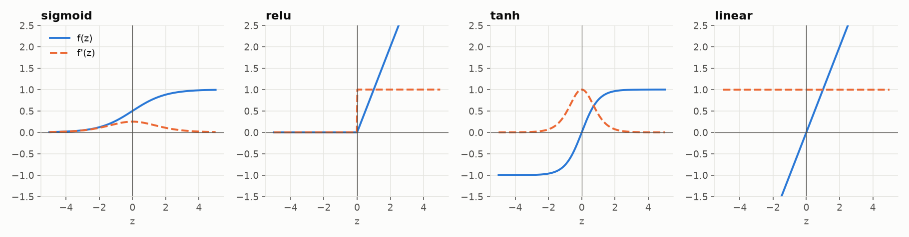

# 03. Activation functions

Module: `nn/activations.py`

## Why they exist

Stack two layers without activation:

$$Z_2 = (X W_1 + b_1) W_2 + b_2 = X (W_1 W_2) + (b_1 W_2 + b_2)$$

That is another linear transformation. You can stack a thousand linear layers and it is still a line.
The non-linear activation between layers is the only thing that lets the network represent curves.

## The four in this project

| Name | Formula | Range | Derivative | Typical use |
|------|---------|-------|------------|-------------|
| Sigmoid | $\frac{1}{1 + e^{-z}}$ | (0, 1) | $\sigma(z)(1 - \sigma(z))$ | Output layer, binary classification |
| ReLU | $\max(0, z)$ | [0, inf) | 1 if $z > 0$, else 0 | Hidden layers (current default) |
| Tanh | $\tanh(z)$ | (-1, 1) | $1 - \tanh^2(z)$ | Hidden layers (pre-ReLU era), RNNs |
| Linear | $z$ | all | 1 | Output layer, regression |

## Sigmoid at the output

It squashes any real number into (0, 1), which we read as $P(y = 1)$. That is why `predict` compares
against `DECISION_THRESHOLD = 0.5`.

Its problem as a hidden activation is the orange curve in the figure: the derivative peaks at 0.25,
at $z = 0$. Every layer multiplies the gradient by at most 0.25. With 10 layers the gradient reaching
the first one is at most $0.25^{10} \approx 10^{-6}$. This is the **vanishing gradient** problem and
it held deep learning back for years.

Numerical detail: in float64, `sigmoid(50.0)` is exactly `1.0`. Mathematically it never gets there,
but the computer does not have infinite decimals. That is why the loss function clips probabilities
before taking the logarithm (`CLIP_EPSILON`). The test `test_sigmoid_is_bounded_and_saturates_in_float64`
pins this behavior.

## ReLU in the hidden layers

Negative becomes zero; everything else passes through. Its derivative is 0 or 1, so it does not
shrink the gradient. It is cheap to compute. It won for those reasons.

Its problem: a neuron whose pre-activation is always negative has derivative 0 always. It never
receives gradient, never updates. This is a **dead ReLU**. He initialization makes it less likely.

## Code design

`Activation` pairs each function with its derivative. The derivative takes the pre-activation $z$, not
the output $a$, so every activation has the same signature. `dense_backward` just calls
`layer.activation.derivative(cache.pre_activation)`, whichever activation it is.

`ACTIVATIONS` maps names to objects. `persistence.py` uses it to rebuild the network when loading from
disk: the file only stores the string `"relu"`.

The test `test_derivative_matches_finite_differences` checks each derivative numerically. It is the
small version of the gradient check in guide 08.

## Experiments

- Swap `RELU` for `SIGMOID` in the hidden layers (`experiment.py`). Training slows down.
- Swap for `TANH`. In a network this small it behaves much like ReLU.
- Swap for `LINEAR`. The decision boundary is a straight line despite two hidden layers. That is the
  first section of this guide, demonstrated.
