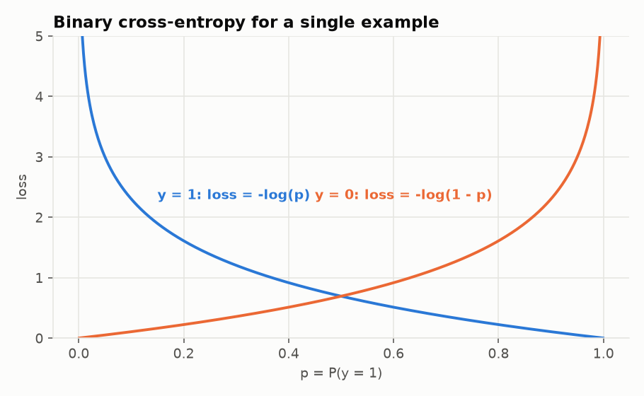

# 04. Loss function

Module: `nn/losses.py`

## What it is

A single number that says how wrong the network is. Lower is better. Training is nothing more than
minimizing this number. The loss you choose defines what "good" means for your model, so pick it deliberately.

## Binary cross-entropy

For binary classification where the network outputs $p = P(y = 1)$:

$$\mathcal{L} = -\frac{1}{n} \sum_{i=1}^{n} \left[ y_i \log p_i + (1 - y_i) \log(1 - p_i) \right]$$

It looks complicated. For a single example only one of the two terms survives:

- If $y = 1$: $\mathcal{L} = -\log p$. With $p = 0.99$ the loss is 0.01. With $p = 0.01$ it is 4.6.
- If $y = 0$: $\mathcal{L} = -\log(1 - p)$. Mirror image.

The logarithm is the point: being confident and wrong is extremely expensive. $-\log(0.001) \approx 7$.
The network learns not to be arrogant.

## Why not squared error

You could use $(y - p)^2$. It works, but worse, for two reasons:

1. **Weak gradients exactly where you need them most.** With sigmoid at the output and MSE, when the
   network is badly wrong ($p \approx 0$, $y = 1$) the sigmoid derivative is nearly 0 and the
   gradient almost vanishes. With cross-entropy, the gradient with respect to $z$ simplifies to
   exactly $p - y$: proportional to the error, no matter how saturated the sigmoid is.
2. **Probabilistic meaning.** Minimizing cross-entropy is the same as maximizing the likelihood of the
   data under a Bernoulli model. It is not an arbitrary choice; it is what statistics says you should
   do if you believe your labels are biased coin flips.

## The clip

`np.clip(y_pred, 1e-12, 1 - 1e-12)` before the logarithm. Without it, `log(0) = -inf` and training
collapses into `nan`. Guide 03 showed that sigmoid can return exactly 0 or 1 in float64. The clip is
the safety net.

## The gradient

`binary_cross_entropy_gradient` returns $\partial \mathcal{L} / \partial p$ for each example:

$$\frac{\partial \mathcal{L}}{\partial p_i} = \frac{1}{n} \cdot \frac{p_i - y_i}{p_i (1 - p_i)}$$

The $1/n$ comes from the mean. This gradient is the first thing that enters the backward pass. The
output layer multiplies it by the sigmoid derivative, $p(1 - p)$, and the denominators cancel, leaving
$(p - y)/n$. Frameworks fuse sigmoid and BCE into one operation (`BCEWithLogitsLoss` in PyTorch)
precisely because of this cancellation: it is more numerically stable. Here they stay separate so you
can watch the chain rule do the work.

## Experiments

- Print the loss for $y = 1$ with $p$ in `[0.5, 0.9, 0.99, 0.999]`. Each extra 9 subtracts roughly the
  same amount. That is the logarithm.
- Remove the clip and train with `--lr 5.0`. You will see `nan`.
