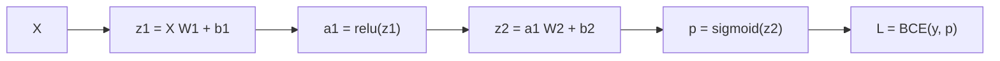
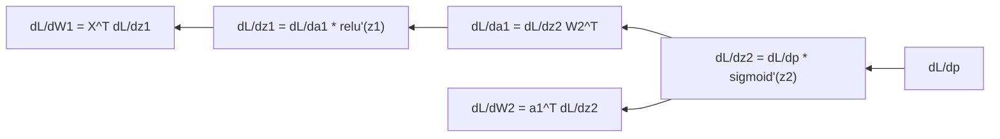

# 05. Backpropagation

Modules: `nn/layers.py` (`dense_backward`), `nn/network.py` (`backward`)

## The problem

You have 337 parameters and one loss value. For each parameter you want to know: "if I nudge this up
a little, does the loss go up or down, and by how much". That is the partial derivative
$\partial \mathcal{L} / \partial w$. The vector of all 337 is the **gradient**.

You could compute it by brute force: nudge one parameter, recompute the whole loss, measure the
difference, repeat 337 times. That is what the gradient check does (guide 08) and it is very slow.
Backpropagation computes all 337 derivatives for roughly the cost of two forward passes.

## The chain rule

If $\mathcal{L}$ depends on $a$, $a$ depends on $z$, and $z$ depends on $w$:

$$\frac{\partial \mathcal{L}}{\partial w} = \frac{\partial \mathcal{L}}{\partial a} \cdot \frac{\partial a}{\partial z} \cdot \frac{\partial z}{\partial w}$$

That is all of backpropagation. The network is a chain of functions, and the derivative of a chain is
the product of the derivatives. Start at the loss and multiply backwards, layer by layer. "Back"
because you move in the opposite direction to the forward pass.

Forward, left to right:

Backward, right to left, starting from the loss gradient:

## One layer backwards

`dense_backward` receives `grad_output` $= \partial \mathcal{L} / \partial a$ (how much this layer's
output is to blame) and returns three things:

| Computed | Formula | Shape | Used for |
|----------|---------|-------|----------|
| `grad_pre_activation` | $\delta = \frac{\partial \mathcal{L}}{\partial a} \odot f'(z)$ | `(batch, n_out)` | Intermediate step |
| `grads.weights` | $X^T \delta$ | `(n_in, n_out)` | Updating $W$ |
| `grads.biases` | $\sum_{batch} \delta$ | `(1, n_out)` | Updating $b$ |
| `grad_inputs` | $\delta W^T$ | `(batch, n_in)` | Becomes `grad_output` of the previous layer |

Look at the shapes: the gradient of a parameter always has the same shape as the parameter. It is the
fastest sanity check you have.

Why $X^T \delta$: $z_j = \sum_i x_i w_{ij} + b_j$, so $\partial z_j / \partial w_{ij} = x_i$. The
derivative of $\mathcal{L}$ with respect to $w_{ij}$ is $x_i \delta_j$, summed over the batch. That
sum is exactly what the matrix product $X^T \delta$ computes.

Why the bias gradient is a sum: the bias was added to every row of the batch by broadcasting in the
forward pass. The derivative of broadcasting is summation. General rule: whatever expands in the
forward pass sums in the backward pass.

## The cache

`DenseCache` stores `inputs` and `pre_activation` from the forward pass because the backward pass
needs them ($X^T$ for the weights, $z$ for $f'(z)$). This is why training uses far more memory than
inference: every layer's intermediate values must be remembered. In large models, activation memory
exceeds parameter memory.

## The whole network

`backward` in `network.py` walks the layers in reverse. Each layer's `grad_inputs` becomes the
previous layer's `grad_output`. It starts with the loss gradient and ends with one gradient per
parameter per layer.

## Autograd

Here every operation's derivative is written by hand. PyTorch, JAX and TensorFlow have **automatic
differentiation**: they record every forward operation in a graph and apply the chain rule for you.
It is the same thing this code does, generalized to any operation. Understanding this manual version
is what lets you debug the automatic one when it misbehaves.

## Experiments

- Add `print(grad_output.shape)` at the top of `dense_backward` and run. Watch the shapes go
  `(32, 1)`, `(32, 16)`, `(32, 16)`.
- Replace `cache.inputs.T @ grad_pre_activation` with `grad_pre_activation.T @ cache.inputs`. The
  gradient check fails with a shape error or a huge relative error. That is its job.
