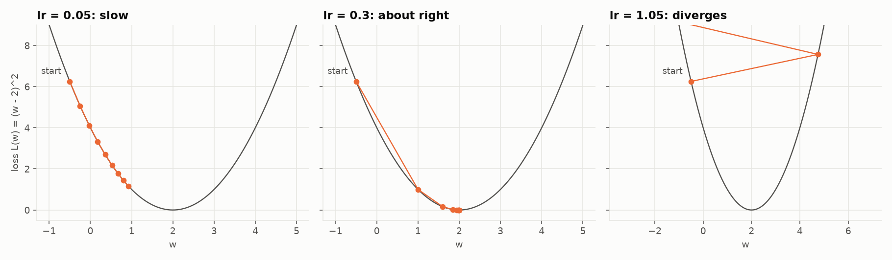
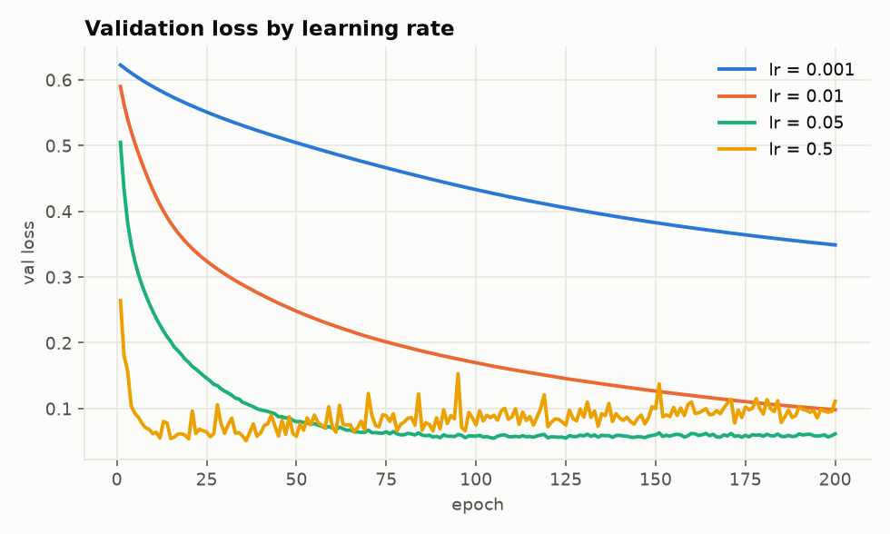

# 06. Gradient descent

Module: `nn/optimizers.py`

## The idea

The gradient points where the loss grows fastest. We want it to shrink, so we step the other way:

$$w \leftarrow w - \eta \cdot \frac{\partial \mathcal{L}}{\partial w}$$

$\eta$ (eta) is the **learning rate**. This is the line `layer.weights - learning_rate * grads.weights`
in `_sgd_update_layer`. That is the whole optimizer.

## Learning rate

The most important hyperparameter. It controls the step size.

The three panels minimize the same parabola from the same starting point, 8 steps each. Too small
and you crawl. Too large and every step overshoots to the other side, higher than before.

On the real network, measured on the validation set:

| Learning rate | What happens |
|---------------|--------------|
| 0.001 | Descends, but 200 epochs is nowhere near enough |
| 0.01 | Gets there eventually |
| 0.05 | Fast descent, settles in the valley |
| 0.5 | Reaches the valley fast, then bounces around inside it because every step is too big to settle |

There is no universal value. It depends on the data scale (which is why we standardize), the
architecture and the loss. You find it by scanning on a log scale: 0.001, 0.01, 0.1, 1.

## Batch, mini-batch and stochastic

The "true" gradient uses all the training data. That is expensive and, surprisingly, unnecessary:

| Variant | Data per step | Pros | Cons |
|---------|---------------|------|------|
| Batch GD | Everything | Exact gradient, smooth path | Slow per step, may not fit in memory |
| Pure SGD | 1 example | Cheap, noise helps escape bad regions | Very noisy, wastes vectorization |
| Mini-batch | 32 to 512 | Best of both | One more hyperparameter |

Everyone uses mini-batch and calls it SGD out of habit. Here `batch_size=32`. A mini-batch gradient is
a noisy estimate of the true one. That noise is not a defect: it acts as a regularizer and helps the
network generalize.

`iterate_batches` reshuffles every epoch. Without that, the network would see the same 32 examples
together in the same order every time and could learn patterns of the ordering instead of the data.

## Epochs

One epoch is one full pass over the training set. With 700 examples and batch 32, that is 22 gradient
steps per epoch. 200 epochs is 4400 steps.

How many epochs: until the **validation** loss stops dropping. Keep going past that and the network
memorizes the training set (overfitting, guide 07).

## Code design

`sgd_step` is a pure function: network and gradients in, new network out. There is no state, which is
exactly what SGD is. Fancier optimizers like Adam do carry state (running averages of past gradients),
and their functional implementation would return `(new_network, new_state)`.

## What is missing

- **Momentum**: remember the previous direction and keep some of it. Reduces zigzag.
- **Adam**: momentum plus a per-parameter adaptive learning rate. The default in practice.
- **Learning rate schedules**: start large, shrink over time.

All of them are refinements of the same line: `w - lr * grad`.

## Experiments

- `uv run foundations --lr 0.001`. 200 epochs is not enough.
- `uv run foundations --lr 3.0`. The loss oscillates or explodes.
- `uv run foundations --batch-size 700`. Batch GD. Smoother curves, slower convergence per epoch.
- `uv run foundations --batch-size 1`. Pure SGD. Noisy, and slow in wall-clock time.
