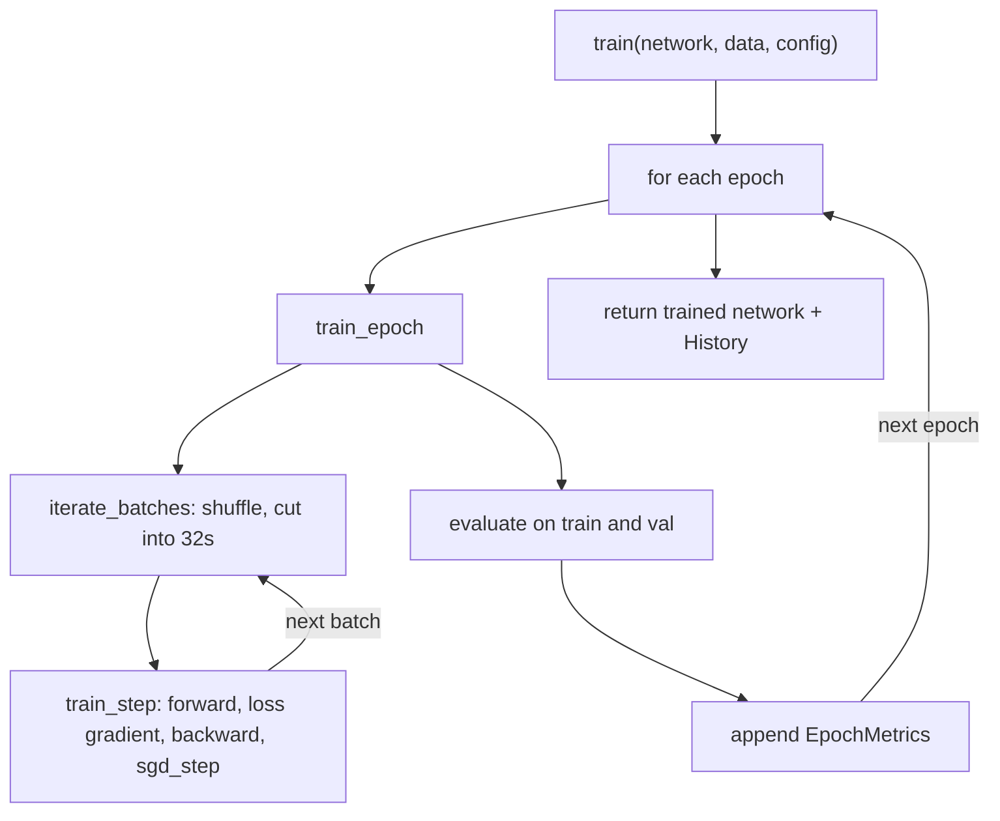
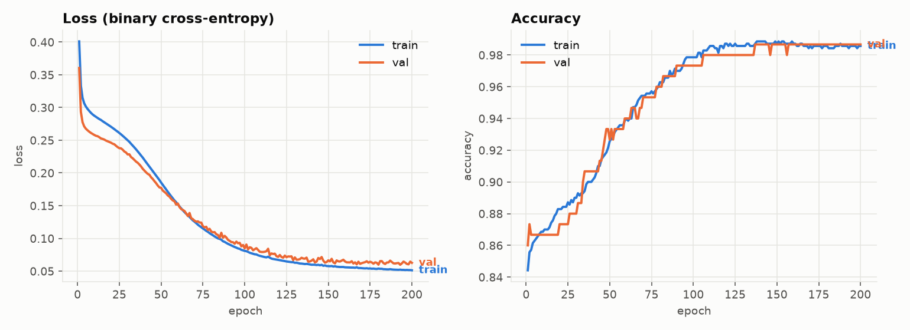
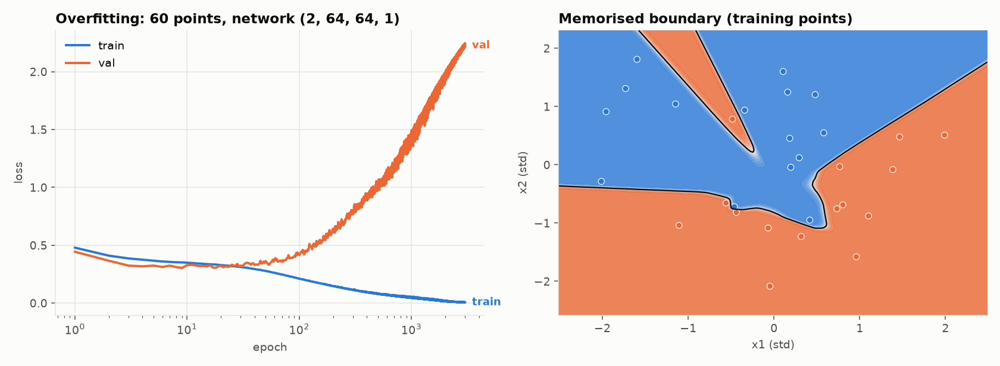

# 07. Training and evaluation

Modules: `training/loop.py`, `training/metrics.py`, `training/history.py`

## The loop

Three functions, three levels of granularity:

| Function | Does | Returns |
|----------|------|---------|
| `train_step` | One gradient update on one batch | New network |
| `train_epoch` | `train_step` on every batch once | New network |
| `train` | `train_epoch` N times, measuring after each | New network and `History` |

Each returns a new network instead of mutating one. You can keep the network from epoch 50 and the
one from epoch 200 side by side, which is convenient for debugging and impossible with in-place updates.

## What a healthy run looks like

Both curves go down together and flatten out. The gap between train and val is small. The network is
learning something that transfers to data it has not seen.

The boundary follows the shape of the moons without contorting around individual points. The few
points on the wrong side are in the noisy overlap region where no reasonable boundary would get them right.

## Overfitting

Same code, different setup: 30 training points, noise 0.35, a network with 4417 parameters, 3000 epochs.
Train loss goes to zero. Validation loss goes down for about 30 epochs and then climbs without end.
The right panel shows why: the boundary has wrapped itself around every training point, including
the noisy ones. It has memorized instead of learned.

This is the single most important pattern to recognize in a training curve. The gap between the two
lines is the **generalization gap**. When it opens, more training makes the model worse.

What to do about it, roughly in order of how often it helps:

1. More data.
2. A smaller network.
3. Stop training when validation loss stops improving (early stopping).
4. Regularization: penalize large weights, or randomly drop neurons during training (dropout).

The opposite failure is **underfitting**: both losses stay high. The network does not have the
capacity to fit even the training data. The single-neuron model in guide 02 underfits the moons.

## Metrics

Loss is what the optimizer minimizes. It is not necessarily what you care about. `metrics.py` has
what you care about for a classifier:

**Accuracy**: fraction of correct predictions. Easy to read, misleading on imbalanced data. If 99% of
emails are not spam, a model that always says "not spam" has 99% accuracy.

**Confusion matrix**: the four ways a binary prediction can go.

| | Predicted 1 | Predicted 0 |
|---|---|---|
| **Actual 1** | true positive | false negative |
| **Actual 0** | false positive | true negative |

**Precision** $= \frac{TP}{TP + FP}$: of the points I called class 1, how many were. Matters when a
false alarm is expensive.

**Recall** $= \frac{TP}{TP + FN}$: of the actual class 1 points, how many I caught. Matters when a
miss is expensive.

You can trade one for the other by moving `DECISION_THRESHOLD`. Lower it and you catch more positives
(recall up) at the cost of more false alarms (precision down). Which one to favor is a product
decision, not a modeling one.

## Loss vs accuracy

They usually move together, but not always. Loss is continuous: a prediction of 0.51 for a class 1
point counts as correct for accuracy but is still penalized by the loss. Near the end of training you
will often see accuracy flat while loss still drops: the network is becoming more confident in
predictions it already got right.

## Experiments

- Reproduce the overfitting figure with `make figures` and then reduce `OVERFIT_LAYERS` to `(2, 4, 1)`
  in `scripts/make_figures.py`. The gap shrinks.
- Change `DECISION_THRESHOLD` to 0.2 and look at precision and recall in the CLI output.
- Set `epochs=20` and compare test accuracy against the default 200.
