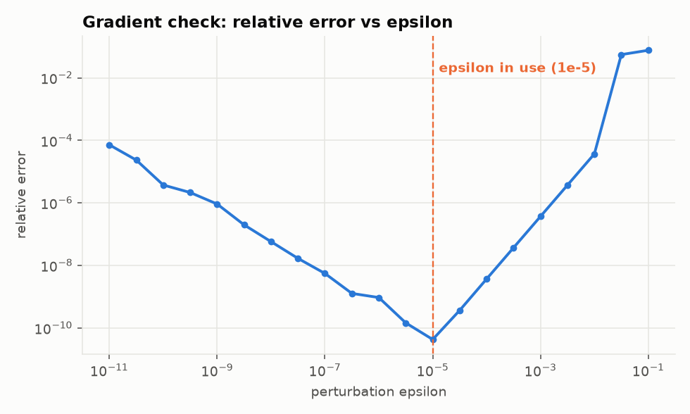

# 08. Gradient check

Module: `diagnostics/gradient_check.py`

## Why

Backpropagation is easy to get subtly wrong. A transposed matrix, a missing sum over the batch, a
derivative evaluated at the output instead of the pre-activation. The dangerous part is that a wrong
gradient often still trains. The loss goes down, slower and to a worse place, and nothing tells you.

The gradient check catches this. It is the unit test of backpropagation.

## How

The derivative has a definition that does not involve any calculus rules:

$$\frac{\partial \mathcal{L}}{\partial w} \approx \frac{\mathcal{L}(w + \epsilon) - \mathcal{L}(w - \epsilon)}{2 \epsilon}$$

Nudge one parameter up by $\epsilon$, compute the loss. Nudge it down, compute the loss. Divide the
difference by $2\epsilon$. This is the **central difference** and it needs no knowledge of the
network's structure, only the ability to run a forward pass.

`gradient_check` does this for every one of the parameters of a small network, then compares against
what `backward` produced:

$$\text{relative error} = \frac{\| g_{analytical} - g_{numerical} \|}{\| g_{analytical} \| + \| g_{numerical} \|}$$

Relative rather than absolute, because a difference of $10^{-6}$ means nothing if the gradients are
around $10^{3}$ and everything if they are around $10^{-6}$.

## Reading the result

| Relative error | Meaning |
|----------------|---------|
| below $10^{-7}$ | Correct |
| $10^{-7}$ to $10^{-4}$ | Probably fine, look for a non-differentiable point (ReLU at exactly 0) |
| above $10^{-4}$ | Bug |

The CLI reports it on every run. The default network gives about $5 \times 10^{-11}$.

## Choosing epsilon

This curve is the whole story of floating point in one plot. Two errors compete:

- **Truncation error**, on the right. The central difference is an approximation that improves as
  $\epsilon$ shrinks, proportionally to $\epsilon^2$.
- **Round-off error**, on the left. $\mathcal{L}(w + \epsilon)$ and $\mathcal{L}(w - \epsilon)$ are
  nearly equal, and subtracting two nearly equal float64 numbers destroys significant digits. The
  smaller $\epsilon$, the fewer digits survive.

The sweet spot is around $10^{-5}$, which is what `PERTURBATION` is set to. It is not arbitrary: the
theory says the optimum is near the cube root of machine epsilon, $\sqrt[3]{2.2 \times 10^{-16}} \approx 6 \times 10^{-6}$.

## Cost

Two forward passes per parameter. For 337 parameters on 5 examples that is instant. For a model with
a billion parameters it is never done. The check runs on a tiny network with a tiny batch, once,
before training. It verifies the code, not the model.

## Experiments

- Break `dense_backward` on purpose: change `grad_pre_activation.sum(axis=0, keepdims=True)` to
  `grad_pre_activation.mean(axis=0, keepdims=True)`. The gradient check reports an error around
  $10^{-1}$ and `test_analytical_matches_numerical` fails. Training still "works", just worse.
- Run `make figures` after changing `PERTURBATIONS` in `scripts/make_figures.py` to extend down to
  $10^{-14}$. Watch the left side of the curve climb toward 1.
