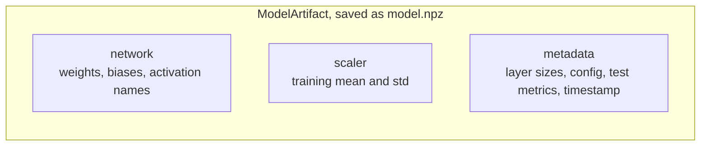
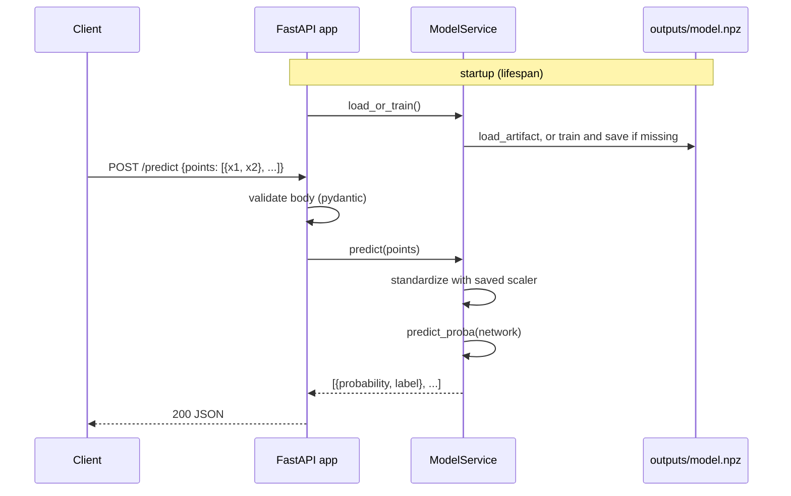

# 09. Persistence and serving

Modules: `persistence.py`, `api/`

## What a trained model is

After training, the model is three things, and forgetting any one of them breaks it:



The **scaler** is the one people forget. The network was trained on standardized inputs. If you feed
it raw coordinates it will produce confident nonsense. The preprocessing is part of the model, and it
must be saved with it and applied identically at inference time. `standardize_split` returns the
`Standardizer` for exactly this reason.

The **metadata** is what lets you answer, six months later, "which model is this, how was it trained,
how good was it". A weights file with no metadata is a liability.

## The file format

`save_artifact` writes a single `.npz` file: a zip of NumPy arrays. Weights and biases go in as
arrays, the scaler as two arrays, and the metadata as one JSON string. `allow_pickle=False` on both
save and load: pickle can execute arbitrary code when loading, so a model file from an untrusted
source could compromise the machine. Plain arrays and JSON cannot.

`load_artifact` reverses it. It rebuilds each `Dense` layer using `ACTIVATIONS[name]` to turn the
stored string back into a function. The test `test_round_trip_preserves_predictions_and_metadata`
checks that predictions from the loaded model are bit-for-bit identical to the original.

## Serving

`uv run foundations-api` starts a FastAPI server. Interactive docs at `http://127.0.0.1:8000/docs`.



| Endpoint | Purpose |
|----------|---------|
| `GET /health` | Is the process up, is a model loaded |
| `GET /model` | Architecture, parameter count, training config, test metrics |
| `POST /predict` | Raw coordinates in, probabilities and labels out |
| `POST /train` | Retrain with new hyperparameters, replace the served model, return the history |

## Validation at the boundary

The request schemas in `api/schemas.py` are the boundary between the outside world and the code.
Pydantic rejects anything malformed before it reaches the model: a non-numeric coordinate, an empty
list, more than 10,000 points in one request, zero epochs, a negative learning rate. Each of these
has a test in `tests/api/test_routes.py` asserting a 422 response.

Inside the boundary, the code trusts its inputs. `predict_proba` does not check shapes. That is
deliberate: validate once at the edge, then move fast.

## Code design

`ModelService` is the one place in the project with mutable state: it holds the current artifact and
swaps it when `/train` finishes. The swap is under a lock so a `/predict` request never sees a
half-written model. Everything below it (`run_experiment`, `predict_proba`) stays pure.

`create_app` is a factory rather than a module-level `app`. Tests call `create_app(tmp_path / "model.npz")`
to get an isolated instance with its own artifact, and never touch `outputs/`.

## Try it

```bash
make serve
curl -X POST localhost:8000/predict \
  -H 'content-type: application/json' \
  -d '{"points": [{"x1": 0, "x2": 1}, {"x1": 1, "x2": -0.5}]}'
```

The first point sits on the upper moon (class 0), the second on the lower one (class 1).

## Experiments

- Delete `outputs/model.npz` and start the server. It trains on startup instead of loading.
- `POST /train` with `{"layer_sizes": [2, 1], "epochs": 100}` and then predict a point in the middle of
  the moons. Compare the probability with the default network.
- Open `outputs/model.npz` with `np.load` and list its keys.
